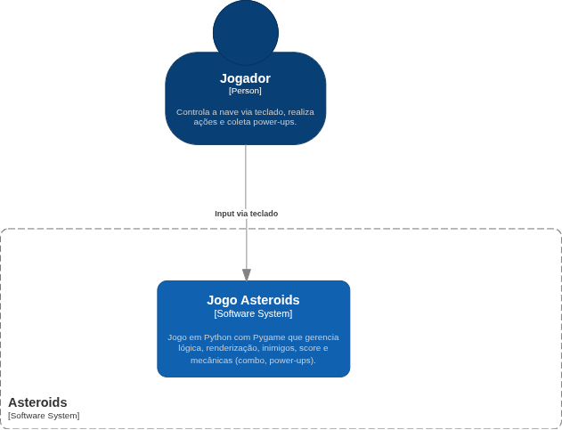
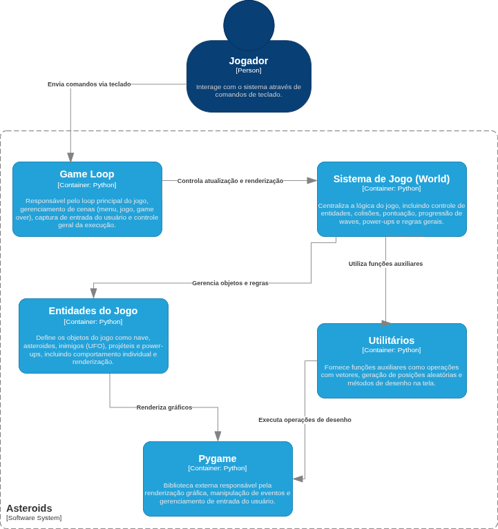
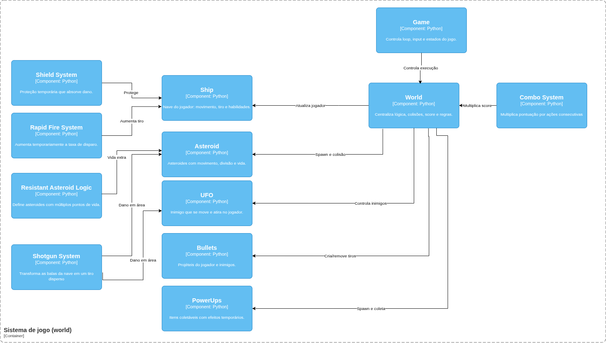

# Asteroids Pygame

Projeto acadêmico em **Python + Pygame** inspirado no clássico **Asteroids**, com foco em organização simples do código, mecânicas arcade e possibilidade de expansão incremental.

O projeto atual já possui uma base jogável com:
- nave controlada por teclado,
- tiro com cooldown e limite de projéteis,
- asteroides com divisão em tamanhos menores,
- UFO inimigo com tiros,
- sistema de ondas,
- score,
- vidas,
- hyperspace,
- menu inicial e tela de game over.  
Esses elementos estão distribuídos principalmente entre `main.py`, `game.py`, `systems.py`, `sprites.py` e `config.py`.

---

## Sumário
- [Objetivo](#objetivo)
- [Estado atual do jogo](#estado-atual-do-jogo)
- [Mecânicas propostas para evolução do projeto](#mecânicas-propostas-para-evolução-do-projeto)
- [Arquitetura básica do projeto](#arquitetura-básica-do-projeto)
- [Estrutura de pastas](#estrutura-de-pastas)
- [Como executar](#como-executar)
- [Controles](#controles)
- [Licença](#licença)

---

## Objetivo

O objetivo do projeto é desenvolver um jogo 2D no estilo arcade, utilizando **Pygame**, com foco em:
- prática de programação orientada a objetos,
- manipulação de sprites e colisões,
- gerenciamento do loop principal do jogo,
- evolução incremental de mecânicas,
- documentação e organização do desenvolvimento em equipe.

Além da base atual, este repositório também pode ser usado como ponto de partida para uma atividade acadêmica de **game design + modelagem + implementação**, em que novas mecânicas são propostas, documentadas e integradas ao código-fonte.

---

## Estado atual do jogo

Na versão atual do repositório, o jogo oferece as seguintes funcionalidades:

### 1. Controle da nave
A nave pode:
- girar para a esquerda e para a direita,
- acelerar,
- disparar projéteis,
- utilizar hyperspace para se teleportar.  
O controle é tratado no loop principal e na classe `Ship`. 

### 2. Sistema de tiro
O jogador possui:
- cooldown entre disparos,
- velocidade definida para os projéteis,
- tempo de vida do tiro,
- limite simultâneo de balas. 

### 3. Asteroides com divisão por tamanho
Os asteroides possuem três tamanhos (`L`, `M` e `S`) e, ao serem destruídos, podem se dividir em fragmentos menores, gerando pontuação diferente para cada tamanho.

### 4. UFO inimigo
O jogo já conta com um inimigo do tipo UFO, que:
- surge periodicamente,
- atravessa a tela,
- tenta atirar na nave,
- concede pontuação ao ser destruído.

### 5. Progressão por waves
Quando não restam asteroides em tela, uma nova onda é iniciada com maior quantidade de inimigos.

### 6. HUD e progressão do jogador
O HUD atual exibe:
- score,
- vidas,
- wave atual.

### 7. Cenas do jogo
O fluxo atual do jogo inclui:
- menu inicial,
- cena principal de gameplay,
- tela de game over. 

---

## Mecânicas propostas para evolução do projeto

As mecânicas abaixo são uma **proposta de evolução** para a atividade da disciplina. 

### 1. Escudo temporário
Ao coletar um item especial, a nave recebe proteção temporária contra colisões ou absorve um impacto.

**Impacto esperado:**
- aumenta a sobrevivência do jogador,
- cria momentos de risco/recompensa,
- adiciona feedback visual relevante.

**Possível impacto no código:**
- novo estado na nave,
- temporizador do escudo,
- atualização da lógica de colisão,
- novo item coletável.

### 2. Combo de pontuação
Destruir vários asteroides em sequência, sem levar dano e sem grande intervalo de tempo, ativa um multiplicador de score.

**Impacto esperado:**
- deixa o gameplay mais dinâmico,
- recompensa precisão e ritmo,
- melhora o sistema de progressão por pontuação.

**Possível impacto no código:**
- contador de combo,
- temporizador para manutenção do combo,
- ajuste no cálculo do score,
- exibição do multiplicador no HUD.

### 3. Asteroide resistente
Alguns asteroides passam a exigir mais de um tiro para serem destruídos.

**Impacto esperado:**
- aumenta a variedade de desafio,
- introduz novos padrões de prioridade em combate,
- mantém forte coerência com a proposta original do jogo.

**Possível impacto no código:**
- atributo de vida para certos asteroides,
- variação visual por tipo,
- atualização no tratamento de colisão bala/asteroide.

### 4. Power-up de tiro rápido
A nave pode coletar um item que reduz temporariamente o cooldown do disparo.

**Impacto esperado:**
- gera sensação de recompensa imediata,
- acelera momentos de ação,
- amplia a variação de partida para partida.

**Possível impacto no código:**
- sistema de power-ups,
- mudança temporária em `SHIP_FIRE_RATE`,
- temporizador de duração,
- indicador visual no HUD.

### 5. Mina espacial
O jogador pode posicionar uma mina no espaço, que explode ao detectar um inimigo próximo ou ao colidir com um asteroide/UFO.

**Impacto esperado:**
- adiciona estratégia além do disparo direto,
- cria novas formas de controle de área,
- torna a movimentação do jogador mais planejada.

**Possível impacto no código:**
- nova entidade `Mine`,
- lógica de ativação/explosão,
- dano em área,
- atualização do sistema de colisões.

---

## Arquitetura básica do projeto

A organização atual do código é simples e adequada para expansão incremental.

### Visão geral dos principais arquivos

#### `main.py`
Ponto de entrada da aplicação. Instancia `Game` e inicia o loop principal. 

#### `game.py`
Gerencia:
- inicialização do Pygame,
- cenas do jogo,
- eventos de teclado,
- troca entre menu, gameplay e game over,
- desenho de telas auxiliares. citeturn818657view1

#### `systems.py`
Coordena o estado do mundo do jogo:
- criação da nave,
- grupos de sprites,
- spawning de asteroides,
- spawning de UFO,
- atualização do mundo,
- colisões,
- score,
- vidas e waves. 

#### `sprites.py`
Define as entidades do jogo, como:
- `Ship`,
- `Bullet`,
- `UfoBullet`,
- `Asteroid`,
- `UFO`. citeturn818657view3

#### `config.py`
Centraliza constantes do projeto, como:
- resolução,
- FPS,
- velocidade da nave,
- atributos dos asteroides,
- parâmetros do UFO,
- parâmetros de tiros,
- cores e outros valores de balanceamento. citeturn818657view2

---

##  Modelo C4

Para representar a arquitetura do sistema, foi utilizado o **Modelo C4**, permitindo visualizar o projeto em diferentes níveis de abstração.

---

### Nível 1 — Contexto

Apresenta uma visão geral do sistema, destacando o jogador como ator principal e o ambiente onde o jogo é executado.



---

### Nível 2 — Containers

Mostra a divisão do sistema em módulos principais, incluindo o loop do jogo, lógica central, entidades e utilitários.



---

### Nível 3 — Componentes

Detalha a estrutura interna do sistema, incluindo entidades e mecânicas como escudo, combo, tiro rápido, asteroides resistentes e minas.



---
## Estrutura de pastas

```bash
asteroids_pygame/
├── src/
│   ├── config.py
│   ├── game.py
│   ├── main.py
│   ├── sprites.py
│   ├── systems.py
│   └── utils.py
├── LICENSE
└── README.md
```

A pasta `src/` concentra toda a lógica principal do jogo, já separando bem:
- entrada da aplicação,
- configurações,
- entidades,
- sistemas,
- utilidades.

---

## Como executar

### Pré-requisitos
- Python 3.10 ou superior
- Pygame instalado

### Instalação

```bash
pip install pygame
```

### Execução

Entre na pasta do projeto e execute:

```bash
cd src
python main.py
```

Se preferir:

```bash
python src/main.py
```

> Dependendo do ambiente, pode ser necessário ajustar o diretório de execução para que os imports locais funcionem corretamente.

---

## Controles

Controles:

- **Seta esquerda**: girar nave para a esquerda
- **Seta direita**: girar nave para a direita
- **Seta para cima**: acelerar
- **Espaço**: atirar
- **Shift esquerdo**: usar hyperspace
- **ESC**: sair do jogo ou voltar ao menu, dependendo da cena
- **Enter / Espaço**: reiniciar após game over  
Esses controles aparecem no loop principal e na tela de menu.


## Licença

Este projeto utiliza a licença **MIT**, conforme indicado no repositório. 
