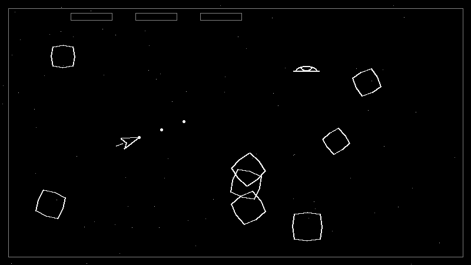

<div align="center">

# ☄️ Asteroids Pygame

**Projeto acadêmico em Python + Pygame inspirado no clássico Asteroids, com foco em mecânicas arcade, organização modular e documentação arquitetural.**


</div>

<p align="center">
  
</p>

---

## ✨ Visão geral

Este projeto implementa uma versão jogável de **Asteroids** com progressão por ondas, power-ups, inimigos e diferentes variações de combate.

Atualmente, o jogo inclui:

- movimentação da nave com rotação, aceleração e inércia
- tiros com cooldown, limite simultâneo e tempo de vida
- **hyperspace**
- asteroides por tamanho com fragmentação
- asteroides resistentes
- **UFO inimigo**
- sistema de **waves**
- sistema de **combo**
- power-ups de **Shield**, **Rapid Fire** e **Shotgun**
- menu inicial, HUD e tela de game over

---

## 🕹️ Mecânicas implementadas

O jogo conta com um conjunto de mecânicas base do gênero arcade, além de novas funcionalidades adicionadas para enriquecer a gameplay.

### Base do jogo
- rotação para esquerda e direita
- aceleração
- movimento com inércia
- hyperspace para reposicionamento rápido
- tiro com cooldown
- limite de projéteis simultâneos
- tiros com tempo de vida
- asteroides grandes, médios e pequenos
- fragmentação em tamanhos menores
- pontuação por tamanho
- **UFO** com disparos
- progressão por **waves**
- aumento gradual da pressão durante a partida
- pontuação por destruição de alvos
- menu inicial
- HUD
- tela de game over

### Mecânicas adicionadas
- **Shield**: proteção temporária para a nave
- **Combo**: aumenta a pontuação ao destruir inimigos em sequência
- **Asteroides resistentes**: exigem mais de um disparo para serem destruídos
- **Rapid Fire**: reduz temporariamente o intervalo entre tiros
- **Shotgun**: libera disparos espalhados por tempo limitado

---

## 🧱 Arquitetura

O projeto está separado em módulos simples para facilitar manutenção e evolução.

### Principais arquivos

- **`src/main.py`**  
  Ponto de entrada da aplicação.

- **`src/game.py`**  
  Gerencia loop principal, estados do jogo, entrada do jogador e renderização.

- **`src/systems.py`**  
  Centraliza score, colisões, waves, power-ups, progressão e game over.

- **`src/sprites.py`**  
  Define entidades como nave, tiros, UFO, asteroides e pickups.

- **`src/config.py`**  
  Reúne constantes de gameplay, balanceamento e parâmetros visuais.

- **`src/utils.py`**  
  Funções utilitárias matemáticas e auxiliares.

---

## 🗂️ Estrutura do projeto

```bash
asteroids_pygame/
├── docs/
│   ├── c4-level-1.png
│   ├── c4-level-2.png
│   ├── c4-level-3.png
│   └── gameplay-preview.gif
├── src/
│   ├── config.py
│   ├── game.py
│   ├── main.py
│   ├── sprites.py
│   ├── systems.py
│   └── utils.py
├── LICENSE
└── README.md
```

---

## 🧩 Diagramas C4

Os diagramas arquiteturais do projeto estão na pasta `docs/`.

### C4 — Nível 1
<p align="center">
  
</p>

### C4 — Nível 2
<p align="center">
  
</p>

### C4 — Nível 3
<p align="center">
  
</p>

---

## 🚀 Como executar

### 1. Clone o repositório

```bash
git clone https://github.com/anabeatrizmaciel/asteroids_pygame.git
cd asteroids_pygame
```

### 2. Instale as dependências

```bash
pip install pygame
```

### 3. Execute o jogo

```bash
cd src
python main.py
```

Ou, se preferir:

```bash
python src/main.py
```

---

## ⌨️ Controles

### Durante a partida
- **← / →**: girar nave
- **↑**: acelerar
- **Espaço**: atirar
- **Shift esquerdo**: usar hyperspace
- **ESC**: sair do jogo

### Menu / Game Over
- **Qualquer tecla**: iniciar no menu
- **Enter** ou **Espaço**: reiniciar após game over
- **ESC**: voltar ao menu

---

## 🛠️ Tecnologias

- **Python**
- **Pygame**
- **Modelagem C4**

---

## 📚 Objetivo acadêmico

Este projeto foi desenvolvido com fins acadêmicos para praticar:

- programação orientada a objetos
- sprites e colisões em jogos 2D
- gerenciamento de estados e cenas
- documentação arquitetural com diagramas C4
- evolução incremental de mecânicas arcade

---

## 🌱 Melhorias futuras

- efeitos sonoros e trilha
- animações de explosão
- recorde local
- tela de pausa
- dificuldade configurável
- feedback visual ainda mais forte para dano e power-ups

---

## 📄 Licença

Este projeto utiliza a licença disponível no arquivo **LICENSE**.
